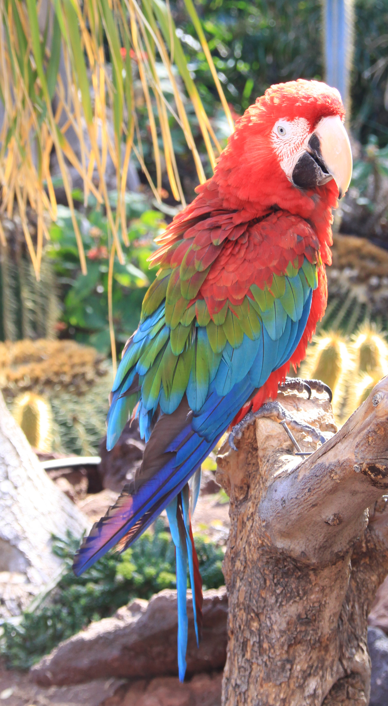
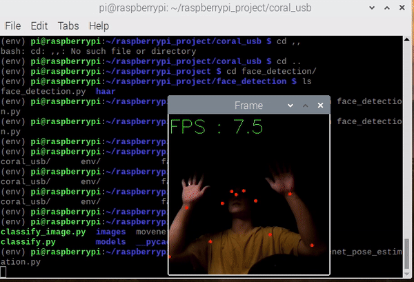
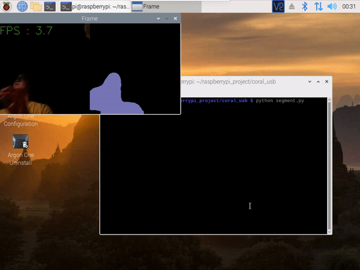

## Set up device
``` bash
echo "deb https://packages.cloud.google.com/apt coral-edgetpu-stable main" | sudo tee /etc/apt/sources.list.d/coral-edgetpu.list

curl https://packages.cloud.google.com/apt/doc/apt-key.gpg | sudo apt-key add -

sudo apt-get update

sudo apt-get install libedgetpu1-std

pip install https://github.com/google-coral/pycoral/releases/download/v2.0.0/tflite_runtime-2.5.0.post1-cp37-cp37m-linux_armv7l.whl
pip install https://github.com/google-coral/pycoral/releases/download/v2.0.0/pycoral-2.0.0-cp37-cp37m-linux_armv7l.whl

# 64 bit OS
# pip install https://github.com/google-coral/pycoral/releases/download/v2.0.0/tflite_runtime-2.5.0.post1-cp37-cp37m-linux_aarch64.whl
# pip install https://github.com/google-coral/pycoral/releases/download/v2.0.0/pycoral-2.0.0-cp37-cp37m-linux_aarch64.whl

```

## Classify bird

```
python classify_image.py \
  --model models/classification/mobilenet_v2_1.0_224_inat_bird_quant_edgetpu.tflite \
  --labels models/classification/inat_bird_labels.txt \
  --input images/parrot.jpg
```



```.language-bash
Initializing TF Lite interpreter...
INFO: Initialized TensorFlow Lite runtime.
----INFERENCE TIME----
Note: The first inference on Edge TPU is slow because it includes loading the model into Edge TPU memory.
11.8ms
3.0ms
2.8ms
2.9ms
2.9ms
-------RESULTS--------
Ara macao (Scarlet Macaw): 0.76562
```

## Pose estimation
``` bash
python movenet_pose_estimation.py
```



## Semantic segmentation
``` bash
python segment.py
```


